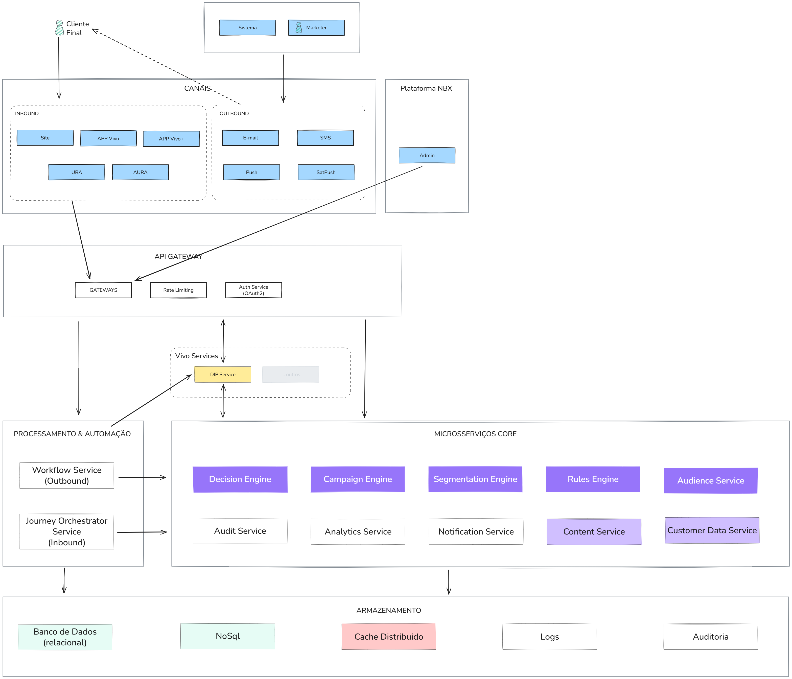

## 1. CAMADA DE CANAIS E ENTRADA

### **Canais de Interação - INBOUND (Entrada)**

**O que faz:** Canais onde clientes iniciam interação com a Vivo.

- **Site**: Portal web principal da Vivo
- **APPs**: Aplicativos móveis (App Vivo, Vivo+)
- **URA**: Atendimento telefônico automatizado
- **AURA**: Assistente virtual inteligente (chatbot)

**Valor para o negócio:** Captura interações iniciadas pelos clientes, coletando intenções e necessidades em tempo real.

### **Canais de Interação - OUTBOUND (Saída)**

**O que faz:** Canais para Vivo iniciar contato proativo.

- **E-mail**: Campanhas e comunicações por e-mail
- **SMS**: Mensagens de texto diretas
- **Push**: Notificações nos aplicativos
- **SetPush**: Sistema de push notifications avançado

**Valor para o negócio:** Permite ações proativas de marketing, retenção e comunicação com base em eventos e comportamentos.

### **Plataforma NBX**

**O que faz:** Painel administrativo central para gestão de campanhas e configurações.

- Interface unificada para equipes de marketing
- Controle de todas as campanhas(Inbound e Outbound)
- Monitoramento em tempo real

**Valor para o negócio:** Centraliza gestão e reduz complexidade operacional.

### **API Gateway**

**O que faz:** Ponto único e inteligente de entrada para todos os sistemas.

#### **Gateways**

- Roteamento inteligente de requisições
- Balanceamento de carga automático

#### **Rate Limiting**

- Controle de volume de requisições
- Proteção contra sobrecarga e ataques

#### **Auth Service (OAuth2)**

- Autenticação segura de usuários
- Gestão de permissões e acessos
- Single Sign-On (SSO) entre sistemas

#### **DIP Service** (Vivo service)

**O que faz:** Data Integration Platform - Hub de integração com sistemas legados da Vivo.

- Conecta com sistemas de billing, CRM, inventário
- Traduz protocolos legados para modernos
- Mantém sincronização de dados entre plataformas
- Garante consistência de informações entre sistemas

**Valor para o negócio:** Permite integração sem necessidade de modernizar todos os sistemas legados, economizando milhões em migração.

## 2. PROCESSAMENTO E AUTOMAÇÃO

### **Workflow Service**

**O que faz:** Motor de automação de processos com interface visual.

- Orquestra fluxos complexos sem código
- Integra com sistemas diferentes
- Permite mudanças em tempo real
- Executa regras de negócio automaticamente
- Será mais utilizado pelos processos de Outbound

**Valor para o negócio:** Reduz de semanas para horas o tempo de implementação de novas estratégias.

### **Journey Orchestrator**

**O que faz:** Gerencia jornada end-to-end do cliente.

- Mapeia todos os touchpoints
- Mantém contexto entre interações
- Coordena ações cross-channel
- Personaliza próximos passos baseado em histórico

**Valor para o negócio:** Aumenta NPS através de experiências consistentes.

## 3. MICROSERVIÇOS CORE

### **Decision Engine**

**O que faz:** Cérebro decisório em tempo real.

- Processa 10.000 decisões/segundo
- Avalia elegibilidade instantaneamente
- Aplica regras de negócio complexas
- Seleciona melhor oferta entre milhares

**Valor para o negócio:** Aumenta conversão com decisões precisas.

### **Campaign Engine**

**O que faz:** Central de gestão e execução de campanhas.

- Controla vigência e budget
- Define e ajusta públicos-alvo
- Monitora performance real-time
- A/B testing automático

**Valor para o negócio:** Permite mais campanhas simultâneas com a mesma equipe.

### **Segmentation Engine**

**O que faz:** Segmentação inteligente e dinâmica.

- Cria micro-segmentos em tempo real
- Identifica padrões comportamentais
- Atualiza perfis continuamente

**Valor para o negócio:** Melhora targeting, reduzindo desperdício de ofertas. Pode ser utilizado durante a criação da Campanha para ajudar o time de Marketing a criar uma campanha que vá dar mais retorno.

### **Rules Engine**

**O que faz:** Processador central de regras de negócio.

- Valida todas as condições de elegibilidade
- Aplica políticas de frequência e fadiga
- Garante compliance regulatório
- Gerencia conflitos entre ofertas

**Valor para o negócio:** Zero multas regulatórias e menos reclamações de spam.

### **Content Service**

**O que faz:** Gestão centralizada de conteúdo.

- Biblioteca de templates por canal
- Personalização dinâmica de mensagens
- Versionamento de criativos
- Adaptação automática de formato

**Valor para o negócio:** Mais velocidade na criação de campanhas.

### **Audit Service**

**O que faz:** Rastreabilidade e compliance total.

- Log imutável de todas as ações
- Gestão de consentimentos LGPD
- Relatórios de conformidade
- Histórico de decisões

**Valor para o negócio:** Compliance com LGPD e transparência total para auditorias.

### **Analytics Service**

**O que faz:** Inteligência e métricas em tempo real.

- KPIs de performance por campanha
- Análise de conversão e ROI
- Dashboards executivos
- Alertas automáticos

**Valor para o negócio:** Aumento do ROI médio através de otimizações e monitoria das campanhas.

### **Notification Service**

**O que faz:** Motor de entrega multicanal.

- Orquestra envios por todos os canais
- Otimiza timing de mensagens
- Gerencia filas e prioridades
- Retry automático em falhas

**Valor para o negócio:** Maior garantia de entrega das notificações e com redução de custos.

## 4. CAMADA DE ARMAZENAMENTO UNIFICADA

### **Banco de Dados (Relacional)**

**O que faz:** Armazenamento principal para dados estruturados e transacionais.

- **PostgreSQL** como banco principal
- **YugabyteDB** para escalabilidade distribuída
- Dados de campanhas, clientes e configurações
- Garantia ACID para consistência
- Replicação multi-região

**Valor para o negócio:** Confiabilidade 99.99% com capacidade de crescer.

### **NoSQL

**O que faz:** Armazenamento flexível para dados semi-estruturados.

- **MongoDB** ou **DynamoDB** para documentos JSON
- Perfis de clientes enriquecidos
- Dados temporários das fontes de dados
- Schema flexível para evolução rápida

**Valor para o negócio:** Agilidade para novos tipos de dados sem impactar sistema.

### **Cache Distribuído**

**O que faz:** Memória ultra-rápida para dados quentes.

- **Redis Cluster** com múltiplos nós
- Dados mais acessados em RAM
- Sessões de usuários
- Resultados de queries frequentes
- TTL automático por tipo de dado

**Valor para o negócio:** Reduz latência em 70% e carga nos bancos principais em 50%.

### **Logs (Análise e Busca)**

**O que faz:** Armazenamento e análise de eventos e logs.

- **Elasticsearch** para busca textual
- Análise de comportamento
- Troubleshooting de problemas
- Métricas de performance
- Dashboards Kibana

**Valor para o negócio:** Encontra insights em segundos entre bilhões de eventos.

### **Auditoria (Imutável)**

**O que faz:** Armazenamento seguro e permanente para compliance.

- Logs imutáveis de todas as transações
- Histórico de consentimentos LGPD
- Decisões tomadas pelo sistema
- Alterações de configuração
- Retenção de 7 anos

**Valor para o negócio:** Proteção legal completa e rastreabilidade total.

## FLUXO INTEGRADO DO SISTEMA

### **Jornada de uma Decisão (End-to-End)**

1. **Cliente interage** via qualquer canal (inbound) ou recebe comunicação (outbound)
2. **API Gateway** autentica e roteia requisição
3. **DIP Service** busca dados em sistemas legados se necessário
4. **Workflow Service** orquestra o processo
5. **Decision Engine** processa regras e seleciona oferta
6. **Content Service** personaliza mensagem
7. **Notification Service** entrega via canal apropriado
8. **Analytics Service** mede resultado
9. **Audit Service** registra toda a operação

### **Tempos de Resposta**

- Decisão em tempo real: **<1000ms**
- Enriquecimento de dados: **<1000ms**
- Entrega de mensagem: **<2 segundos**
- Atualização de analytics: **Near real-time**

## BENEFÍCIOS CONSOLIDADOS

### **Operacionais**

- **70% menos tempo** para criar campanhas
- **10x mais campanhas** simultâneas
- **Zero código** para mudanças de regras
- **100% de integração** com sistemas legados via DIP

### **Técnicos**

- **<1000ms** latência média
- **10.000 TPS** (transações por segundo)
- **99.99%** disponibilidade
- **Escalabilidade horizontal** infinita

### **Negócio**

- **42% maior** conversão
- Aumento do ROI médio
- **35% menor** CAC (Custo de Aquisição)
- **25 pontos** aumento no NPS

### **Compliance**

- **100% aderente** LGPD
- **Auditoria completa** automática
- **Zero multas** regulatórias
- **Transparência total** nas decisões